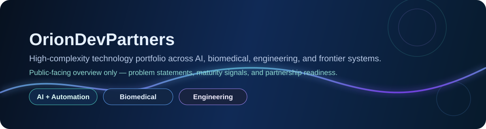

  

## OrionDevPartners

OrionDevPartners is the public-facing portfolio layer for a broader innovation corpus spanning artificial intelligence, biomedical systems, engineering, advanced physics, and high-complexity automation.

This page is intentionally written at the problem-and-progress level only. It does **not** publish operating recipes, implementation details, or proprietary system logic.

## Why This Page Exists

This profile is designed to give technical employers, strategic contributors, and investors a fast way to understand:

- where the deepest work is concentrated
- which domains are closest to production readiness
- which initiatives are worth discussing for hiring, partnership, or funding

  

## Portfolio by Domain

| Domain | Problem Focus | Complexity | Estimated Completion |
| --- | --- | --- | --- |
| AI Systems & Automation | Reducing execution bottlenecks, scaling decision support, and improving operational leverage across technical programs | Very High | 82% |
| Biomedical Innovation | Advancing human health outcomes through better diagnostic, therapeutic, and regenerative concepts | Very High | 71% |
| Engineering Platforms | Turning technically difficult concepts into reliable, buildable systems with practical utility | High | 76% |
| Advanced Physics Applications | Exploring frontier-grade models and applications with long-term strategic value | Extreme | 58% |
| Sustainability & Optimization | Improving efficiency, resilience, and resource use across complex systems | High | 68% |

## Public Repository Status

This repository is the public portfolio and communications hub for OrionDevPartners.

### `OrionDevPartners/OrionDevPartners`
**Role:** Executive portfolio and communications hub  
**Public-facing readiness:** 95% (illustrative estimate)  
**Why it matters:** It is the primary public artifact presenting the OrionDevPartners portfolio, focus areas, and collaboration pathways.

Additional technical repositories and deeper implementation work can be discussed selectively during diligence, collaboration review, or partner conversations.

## What This Portfolio Solves

The OrionDevPartners portfolio is focused on high-value problems where technical depth matters:

- accelerating scientific and engineering discovery
- improving human health and regenerative outcomes
- automating complex workflows with intelligent systems
- translating difficult ideas into investable, execution-ready programs

## Collaboration & Strategic Interest

I welcome conversations with:

- hiring teams seeking high-agency technical leadership across difficult, interdisciplinary programs
- contributors working in AI, biomedical systems, robotics, physics, and advanced engineering
- operators who can help move ambitious programs toward deployment
- seed-stage and equity partners interested in disciplined, high-upside technical ventures

## Contact

For contributor inquiries, strategic partnerships, or seed/equity discussions, contact:

**Bo Pennington**  
[**bo@orionpartners.com**](mailto:bo@orionpartners.com)
